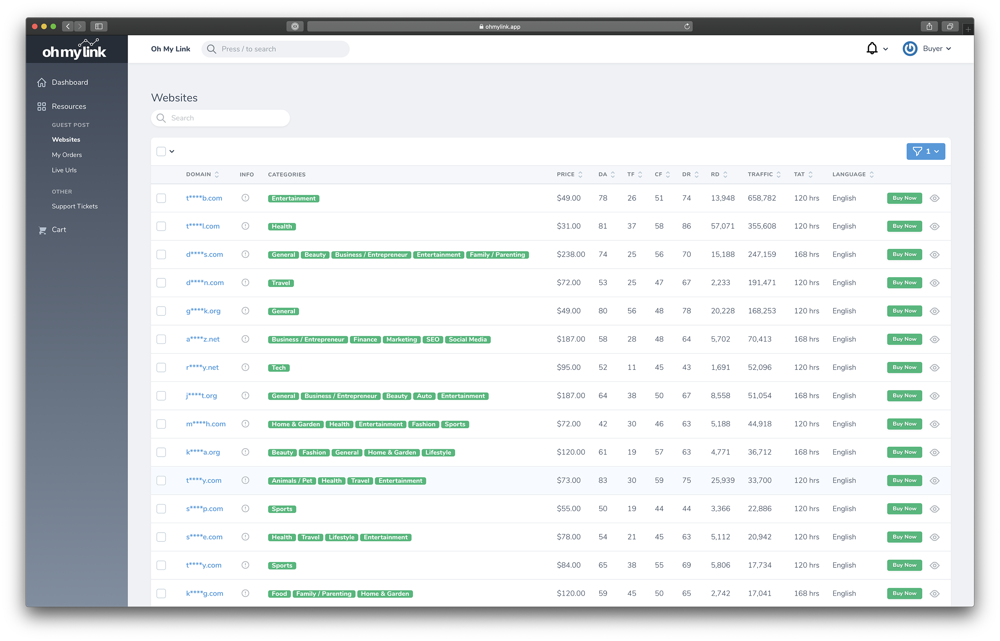

# Giới thiệu

[[toc]]

## Oh My Link là gì?

Oh My Link là một chợ mua và bán Guest Posts - nơi cung cấp cho bạn những backlinks chất lượng từ những website đã được qua kiểm duyệt kỹ lưỡng. Còn nếu bạn đang là chủ sỡ hữu của các websites và muốn kiếm thêm nguồn thu nhập, thì Oh My Link cũng là nơi lý tưởng để bạn có thể thu về một ít lợi nhuận bằng cách đăng bán Guest Posts từ chính những websites đó.

## Đăng ký tài khoản

Khi đăng ký tài khoản trên Oh My Link, bạn phải chọn một trong hai vai trò: **Người mua** (Buyer) hoặc **Người Bán** (Seller).

::: warning Lưu ý:
Bạn sẽ không thể thay đổi vai trò của bạn sau khi đã đăng ký tài khoản. Nếu bạn muốn chuyển từ **Người mua** sang **Người Bán** hoặc ngược lại, bạn vui lòng đăng ký một tài khoản khác.
:::

### **Người Mua** là những ai?

- Những bạn đang kẹt trong việc tìm nguồn backlink phong phú và đa dạng.
- Những bạn mới khởi đầu nhưng chưa có nguồn backlink giá cả phù hợp với ví tiền.
- Các *SEOer* đang muốn tìm nguồn backlinks phong phú cho client của mình.
- Các *Affiliate Marketer* đang quá đau đầu với việc gửi email Guest Posts cho các bloggers.
- Các chủ shop *Dropship Shopify* muốn đặt Guest Post để promote sản phẩm lên những website có lượng traffic cao.
- Các *Bloggers* đã có content chất ngang tầm đối thủ và muốn đè bẹp đối thủ bằng links.

:::tip Mẹo nhỏ:

Chém thế chứ bạn có tiền là lên đăng ký tài khoản rồi lấy links thôi :)
:::

**Oh My Link sẽ mang lại cho bạn:**

- Các websites thật với traffic thật.
- Các websites trải rộng hơn 69 niches.
- Nói không với các Spam PBNs và Link Farm.
- Quản lý và theo dõi 24/7 backlink đang "sống" hay đã "chết" - không lo backlink bị blogger âm thầm đổi từ *Dofollow* sang *Nofollow*.
- Bộ lọc giúp dễ dàng lựa chọn site với chỉ số từ Moz, Majestic, Ahrefs và niches mong muốn.
- Giá cả hợp vãi cả lý.
- Thanh toán online qua thẻ tín dụng hoặc Paypal.
- Hệ thống dashboard đầy đủ giúp quản lý đơn hàng, thống kê chi phí, số lượng Guest Post đã mua theo từng mốc thời gian.
- Nhận thông báo real-time hay email, Slack, Discord khi đơn hàng được cập nhật.

### **Người Bán**, các bạn là ai?

- Những bạn muốn kiếm thêm thu nhập từ chính các websites của mình.
- Những agency cung cấp dịch vụ bán Guest Post muốn tìm thêm những kênh bán hàng mới.

**Oh My Link sẽ mang lại cho bạn:**
- Thêm website và đăng bán chỉ trong vòng 5 giây.
- Hỗ trợ thêm hàng loạt website bằng file Excel.
- Bạn thêm website và quy định cho các bài viết, Oh My Link sẽ giúp bạn lấy toàn bộ chỉ số từ Moz, Majestic, Ahrefs.
- Nhận thông báo real-time hay email, Slack, Discord khi có người mua Guest Posts.
- Quản lý đơn hàng, doanh thu.
- Thống kê các website bán chạy nhất, số lượng đơn hàng theo ngày / tháng /năm.

:::warning Lưu ý:
Các websites sẽ được kiểm tra có đáp ứng được yêu cầu trước khi được xuất hiện trên Oh My Link.
:::

