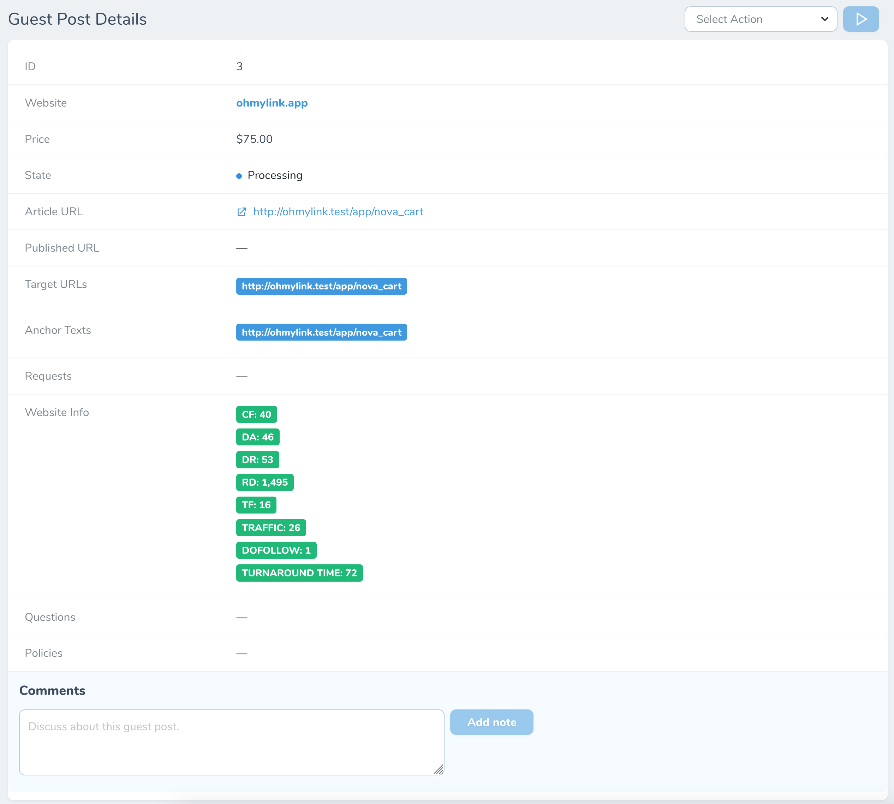
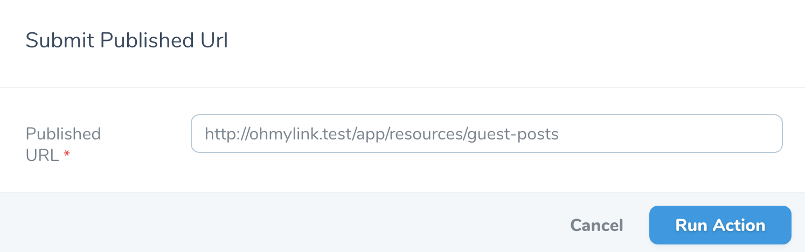
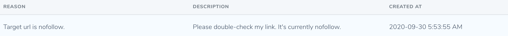

# Guest Posts

[[toc]]

## Giới thiệu

Bạn sẽ nhận được thông báo real-time, email, Slack, Discord khi có người đặt guest post trên website của bạn. Bạn có thể truy cập mục **Guest Post** tại sidebar bên trái để xem toàn bộ đơn hàng.

## Xem chi tiết Guest Post

Để xem chi tiết guest post, bạn hãy nhấn vào icon hình **con mắt**. Tại đây bạn sẽ thấy được toàn bộ các thông tin mà người dùng gửi cho bạn.

Hãy để ý trường **Article URL**, đây chính là bài viết mà người mua muốn đăng lên website của bạn.

:::tip Mẹo nhỏ:
Bạn cũng có thể trao đổi với người mua thông qua hệ thống **comment** ở trang chi tiết.
:::

## Các trạng thái của Guest Post

- **Processing**: Guest Post đang đợi bạn đăng bài.
- **Live**: Guest Post đã được đăng.
- **Live - Rejected**: Guest Post đã được đăng nhưng đã bị từ chối bởi người mua.
- **Complete**: Guest Post đã hoàn thành.

## Cách nộp bài đăng Guest Post

Sau khi bạn đã đăng bài lên website của bạn, hãy click vào nút **Submit Published Url** để gửi URL bài viết cho người mua.

:::warning Có thể bạn thừa biết:
- Nút **Submit Published Url** chỉ xuất hiện với các websites đang ở trạng thái **Processing**.
- Ngoài trang chủ, bạn cũng có thể tìm thấy nút **Submit Published Url** ở trang chi tiết của từng **Guest Post**.
:::

Sau khi bạn gửi URL tới người mua, Guest Post sẽ chuyển sang trạng thái **Live**.

Người mua sẽ nhận được thông báo về việc này. Sau khi xem xét, người mua có quyền từ chối hay chấp nhận bài đăng của bạn.

### Làm gì khi bài đăng bị từ chối?

Bạn sẽ nhận đuợc thông báo kèm theo lý do người mua từ chối bài đăng - lúc này Guest Post sẽ ở trạng thái **Rejected**. Bạn cũng có thể xem lại lý do từ chối ở trang chi tiết Guest Post.

Khi này bạn cần trao đổi với người mua bằng hệ thống **comment** để giải quyết các vấn đề tồn đọng.

### Bài đăng được chấp nhận, khi nào nhận thanh toán?

Nếu bài viết của bạn được chấp nhận, hệ thống sẽ chuyển trạng thái Guest Post sang **Complete**. Bạn sẽ nhận được thanh toán sau **14 ngày** kể từ ngày bài đăng được chấp nhận.

:::tip Có thể bạn chưa biết: 
Sau 2 ngày kể từ ngày bạn gửi bài đăng cho người mua (không tính các ngày cuối tuần), nếu người mua không **chấp nhận** hay **từ chối**, hệ thống sẽ tự động chấp nhận bài viết đó.
:::