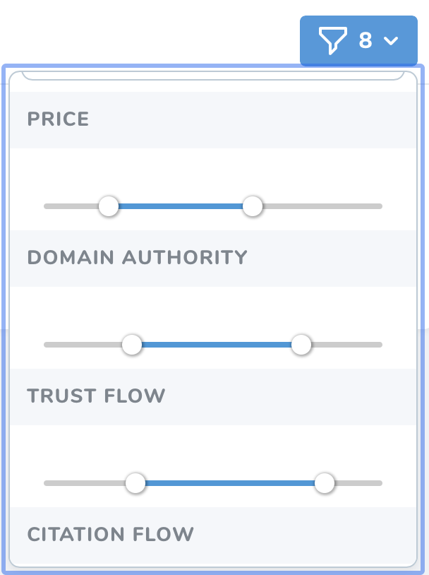

# Websites

[[toc]]

## Giới thiệu

**Websites** là nơi giúp bạn đăng ký và quản lý các websites tại Oh My Link. Để đăng ký websites bạn cần phải đăng nhập bằng tài khoản **Seller**.

## Đăng ký website

Oh My Link cho phép bạn đăng ký số lượng website không giới hạn nhưng có một vài lưu ý trước khi bạn cần biết trước khi bắt đầu đăng ký một website.

### Lưu ý trước khi đăng ký website

- Oh My Link không chấp nhận các link farm, spam, directory websites.
- Guest post phải được đăng trên tên miền chính, không phải tên miền phụ.
- Guest post không được đánh dấu là Guest Post (Bài đăng khách) hay Sponsored Post (Bài quảng cáo) hay những từ ngữ khác liên quan.
- Oh My Link sẽ duyệt các websites của bạn trước khi chúng được xuất hiện trong danh sách.
- Guest post phải được đăng với ít nhất 1 dofollow link.

Nếu các websites của bạn đáp ứng được những yêu cầu trên thì chuyển tới phần đăng ký thôi nào!

Để đăng ký website, bạn hãy nhấn vào nút **Register Website**. Bạn sẽ được chuyển tới màn hình đăng ký gồm các trường như sau:

#### Domain

Nhập tên miền website mà bạn muốn đăng ký. Nếu tên miền đã được đăng ký nhưng bạn là chủ của website đó. Vui lòng xem hướng dẫn cách xác nhận quyền sở hữu website tại đây.

#### Description

Nhập mô tả website của bạn. Oh My Link cho phép người mua tìm kiếm dựa trên trường mô tả này. Việc nhập các từ khóa liên quan tới chủ đề của website cũng sẽ giúp người mua tìm ra website của bạn dễ dàng hơn.

:::danger Lưu ý: 
Bạn không nên nhập các thông tin để lộ danh tích website của bạn như tên thương hiệu, nội dung của thẻ title, meta description.
:::

#### Dofollow Links

Bạn cho phép bao nhiêu dofollow link trong một bài guest post.

#### Language

Ngôn ngữ chính của website.

#### Turnaround Time (Hours)

Thời gian tối đa để đăng bài lên website của bạn kể từ khi bạn nhận được bài viết từ người mua. Đơn vị là giờ.

#### Price

Nhập giá cho một guest post trên website của bạn.

#### Is Article Included

Giá trên có bao gồm bài viết hay chưa?

:::tip Mẹo nhỏ: 
Nếu bạn muốn tự viết bài để đảm bảo chất lượng bài viết thì có thể tick vào ô này và tăng giá tiền lên cao hơn một tý.
:::

#### Categories

Hãy chọn những danh mục liên quan tới chủ để của website của bạn. Tối đa là **5 danh mục**.

#### Publishing Limit

Giới hạn số guest post cho website của bạn trong 1 tháng. 

**Ví dụ:** Website của bạn chỉ nhận 2 guest posts một tháng. Sau khi đủ 2 guest posts hệ thống sẽ động lọc website của bạn ra khỏi danh sách và tự động thêm lại vào ngày đầu tiên của tháng.

#### Questions 

Các câu hỏi để giúp người mua hiểu rõ hơn về website của bạn.

#### Guest Post Policies

Bạn có thể tùy ý đưa ra các điều khoản hay yêu cầu cho người mua. 

**Ví dụ:** Yêu cầu số từ của bài viết phải lớn hơn 500.

:::warning Lưu ý:
- Sau khi quá trình đăng ký hoàn tất, hệ thống sẽ tự động lấy các chỉ số từ Moz, Majestic, Ahrefs của website của bạn. Khi này, website sẽ ở trạng thái **Pending** - Chờ duyệt.
- Các chỉ số của website sẽ được cập nhật hàng tháng.
:::

Bạn sẽ nhận được thông báo real-time, email, Slack hay Discord khi website của bạn được duyệt hay bị tự chối.

### Làm gì khi website bị từ chối

Khi website bị từ chối bạn có thể xem chi tiết lý do bằng cách nhấn vào icon hình **con mắt** tại màn hình trang chủ **Website**.

Nếu bạn muốn đăng ký lại website này, hãy cải thiện nó và gửi lại đơn đăng ký.

### Chỉnh sửa cập nhật website sau khi đăng ký

Bạn có thể chỉnh sửa lại các thông tin website bằng cách nhấn vào icon hình **cây bút**.

:::warning Lưu ý:
- Bạn không thể sửa domain.
- Sau khi bạn chỉnh sửa thông tin website của bạn sẽ ở trạng thái **Updating** - Người mua sẽ không thấy website của bạn khi ở trạng thái này.
:::

## Các trạng thái của website

- **Pending:** Website đang ở trạng thái duyệt - *Người mua sẽ không tìm thấy website của bạn.*
- **Updating:** Website đang được cập nhật thông tin - *Người mua sẽ không tìm thấy website của bạn.*
- **Rejected:** Website của bạn đã bị từ chối.
- **Ready:** Website của bạn đã được duyệt và tất nhiên người mua sẽ tìm thấy được website của bạn trên Oh My Link.

## Bộ lọc cho website

Oh My Link cung cấp các bộ lọc để bạn có thể quản lý các website của mình một cách thuận tiện hơn.

- Lọc theo **Trạng thái** (Ví dụ: Updating).
- Lọc theo **Danh Mục** (Ví dụ: Fitness, Recipes, Outdoor, Garden, Home, ...).
- Lọc theo **Giá**. Ví dụ: Từ $70 - $100.
- Lọc theo **Domain Authority (Moz)**. Ví dụ: Từ 10-25.
- Lọc theo **Trust Flow (Majestic)**. Ví dụ: Từ 10-20.
- Lọc theo **Citation Flow (Majestic)**. Ví dụ: Từ 10-20.
- Lọc theo **Domain Rating (Ahrefs)**. Ví dụ: Từ 20-40.
- Lọc theo **Referring Domain (Ahrefs)**. Ví dụ: Từ 200-700.
- Lọc theo **Monthly Traffic (Ahrefs)**. Ví dụ: Từ 500-5000.

 

:::tip Mẹo nhỏ: 
Nhấn Reset Filter để tắt tất cả bộ lọc.
:::

