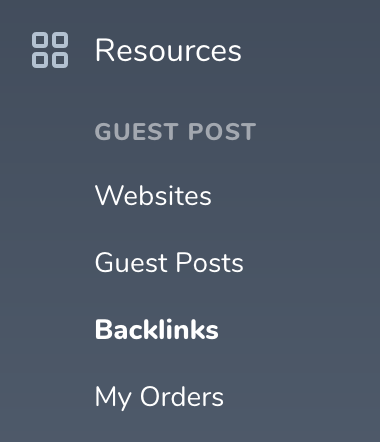
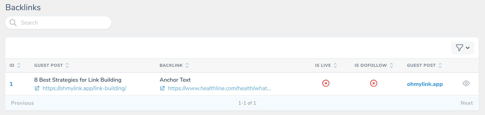

# Backlinks

[[toc]]

## Giới thiệu

Sau khi bạn [chấp nhận Guest Post](/vi/nguoi-mua/guest-posts.html#chap-nhan-published-url), Oh My Link sẽ quét qua bài đăng của bạn và lấy toàn bộ backlinks có trong bài.

Bạn có thể xem backlinks của mình bằng cách bấm vào icon hình *con mắt* tại trang [chi tiết Guest Post](/vi/nguoi-mua/guest-posts.html#xem-chi-tiet-guest-post), hoặc bạn có thể xem toàn bộ backlinks ở mục **Baclinks** tại sidebar bên trái của màn hình Dashboard.

## Theo dõi các backlinks

Oh My Link hỗ trợ bạn theo dõi các backlinks xem có bị tháo bỏ hay bị chuyển từ *dofollow* sang *nofollow* hay không. Hệ thống sẽ gửi thông báo real-time, email, Slack, hay Discord cho bạn nếu 2 trường hợp trên xảy ra.

Bạn không cần làm một thao tác gì cả, toàn bộ backlinks của bạn sẽ được tự động theo dõi 24/7.

:::tip Tìm kiếm nhanh backlink
Bạn có thể sử dụng công cụ tìm kiếm tại màn hình trang chủ **Backlinks** để tìm kiếm backlink. Oh My Link hỗ trợ tìm kiếm theo tiêu đề bài viết, url bài viết, target url (backlink), anchor text.
:::