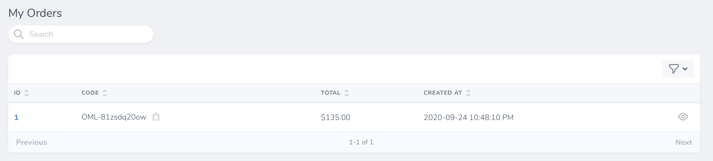
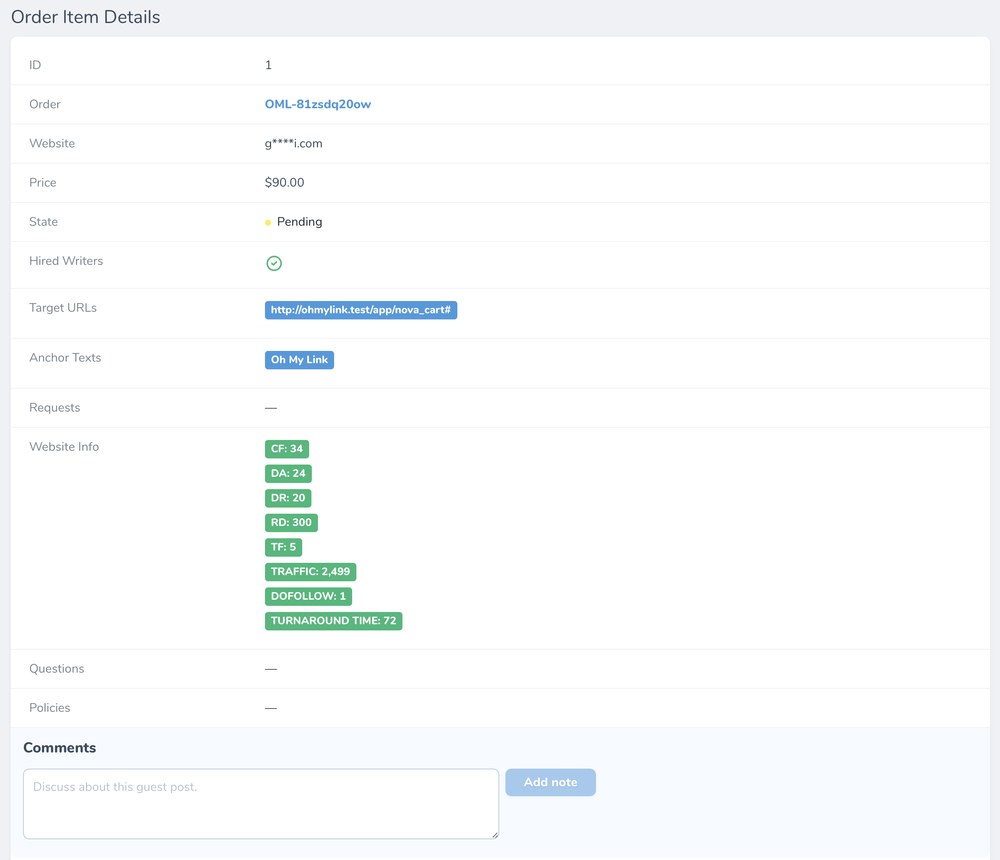
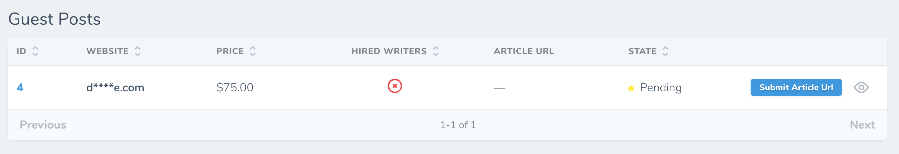
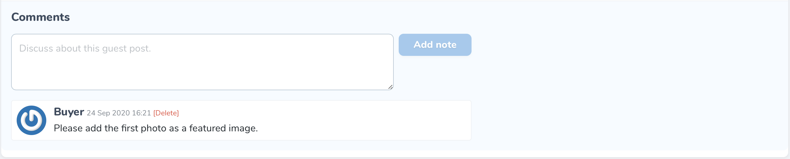

# Đơn Hàng - Guest Post

[[toc]]

## Giới thiệu

Mọi đơn hàng của bạn thực hiện trên Oh My Link đều sẽ được lưu trữ tại đây. 

Bạn sẽ thấy được mã đơn hàng (sử dụng cho việc hỗ trợ), giá trị đơn hàng, ngày thực hiện giao dịch tại màn hình trang chủ.

## Xem chi tiết đơn hàng

Để xem chi tiết đơn hàng, bạn hãy bấm vào biểu tượng hình *con mắt*.

Khi đó, bạn sẽ thấy được các Guest Posts mà bạn đã đặt, cũng như các thông tin, trạng thái và giá tiền của chúng.

Bạn cũng sẽ thấy các khoản phụ thu (nếu có). **Ví dụ:** Phí thuê Writer để viết bài.

:::tip Mẹo nhỏ:
Bạn cũng có thể bấm vào biểu tượng hình *con mắt* để xem chi **tiết từng Guest Post** và **phụ thu** (nếu có).
:::

## Các trạng thái của Guest Post

- **Pending**: Guest Post đang đợi duyệt.
- **Processing**: Guest Post đang được tiến hành bởi người bán.
- **Live**: Guest Post của bạn đã được đăng.
- **Live - Rejected**: Guest Post của bạn đã được đăng nhưng [Live Url](/vi/nguoi-mua/live-url) bị từ chối.
- **Complete**: Guest Post đã hoàn thành.

:::tip Nhận thông báo:
Bạn sẽ nhận được thông báo nếu guest post của bạn được đăng (Live).
:::

## Nộp bài viết

Nếu bạn chưa nộp bài viết trong quá trình đặt đơn hàng thì bạn có thể nộp bằng cách nhấn vào nút **Submit Article URL**.

:::tip Có thể bạn chưa biết
Nếu trong vòng 3 ngày nếu bạn không nộp bài viết, hệ thống sẽ gửi thông báo nhắc nhở cho bạn. Thông báo chỉ được gửi 1 lần duy nhất.
:::

## Trao đổi với người bán

Nếu bạn có vấn đề gì cần trao đổi với người bán thì có thể để lại tin nhắn ở trang **chi tiết Guest Post**.

