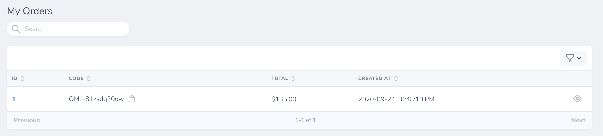

# Đơn Hàng

[[toc]]

## Giới thiệu

Mọi đơn hàng của bạn thực hiện trên Oh My Link đều sẽ được lưu trữ tại đây. 

Bạn sẽ thấy được mã đơn hàng (sử dụng cho việc hỗ trợ), giá trị đơn hàng, số lượng guest posts được đặt, ngày thực hiện giao dịch tại màn hình trang chủ.

## Xem chi tiết đơn hàng

Để xem chi tiết đơn hàng, bạn hãy bấm vào biểu tượng hình *con mắt*.

Khi đó, bạn sẽ thấy được các Guest Posts mà bạn đã đặt, cũng như các thông tin, trạng thái và giá tiền của chúng.

Bạn cũng sẽ thấy các khoản phụ thu (nếu có). **Ví dụ:** Phí thuê Writer để viết bài.

:::tip Có thể bạn chưa biết:
Một đơn hàng sẽ có nhiều Guest Posts và Surcharges (Phụ thu).
:::
