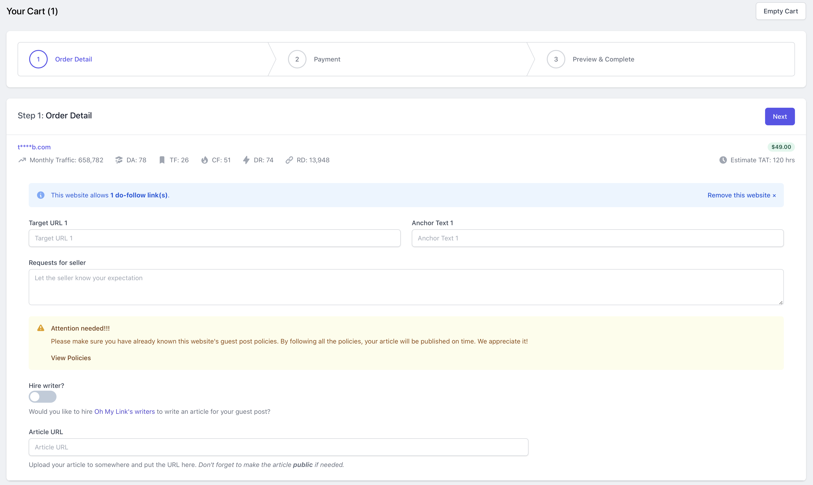
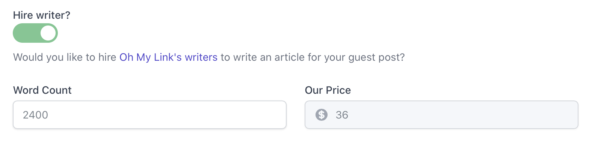
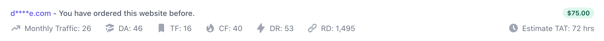
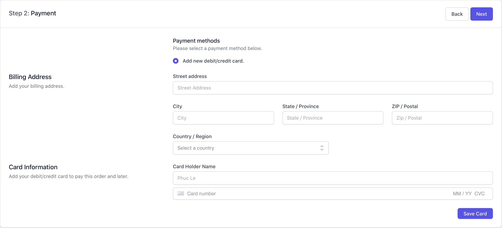
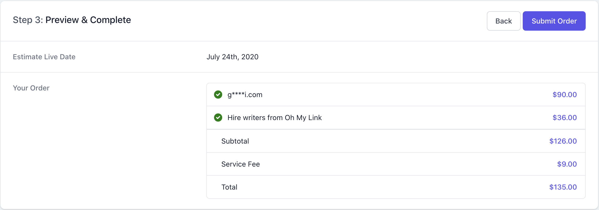

# Giỏ Hàng

[[toc]]

## Giới thiệu

Sau khi đặt mua Guest Posts, thì bạn sẽ được chuyển tới trang **Giỏ Hàng**. Trang này sẽ gồm **3 bước**:

**Bước 1:** Điền các thông tin cần thiết như: Anchor Text, URL mà bạn muốn liên kết,...

**Bước 2:** Chọn phương thức thanh toán.

**Bước 3:** Xem lại đơn hàng và thực hiện thanh toán.

## Bước 1: Nhập thông tin

Ở bước đầu tiên, bạn sẽ được yêu cầu nhập đầy đủ các thông tin như: **Anchor Text**, **Target URL** (Link mà bạn muốn trỏ về), **yêu cầu cho chủ website** (người bán).

:::tip Mẹo nhỏ:
Một số trang web sẽ cho phép bạn đăng nhiều hơn 1 dofollow link, khi đó hệ thống sẽ xuất hiện thêm các trường như: Anchor Text 2, Target URL 2,... 

Nếu bạn chỉ muốn trỏ về 1 link duy nhất thì hãy để trống những trường này.
:::

Tiếp theo, bạn sẽ được hỏi là có thuê Writer để viết bài hay sử dụng bài viết có sẵn của bạn. 

**Lưu ý:** Nếu người bán kèm theo bài viết trong giá bán thì bạn sẽ không thấy trường này.

Nếu bạn muốn thuê Writer của Oh My Link viết bài thì hãy nhập số từ và yêu cầu của bạn cho writer. Hệ thống sẽ cho bạn biết giá tiền của bài viết.

Nếu bạn không muốn thuê Writer thì hãy nhập URL của bài viết vào ô **Article URL**. Đừng quên để bài viết ở chế độ "Công khai / Public" nếu có. Bạn cũng có thể cập nhật URL bài viết sau khi đơn hàng được đặt nếu chưa có sẵn bài viết.

::: danger Lưu ý:
Trước khi nộp bài viết hay thuê Writer, bạn nên xem qua các điều khoản hay yêu cầu về Guest Post của người bán để không bị trễ thời gian nhận backlinks. 
:::

### Kiểm tra website đã mua trước đó hay chưa?

Mặc định, Oh My Link sẽ không lọc các website bạn đã mua trước đó ra khỏi danh sách vì một số bạn sẽ muốn mua lại Guest Post trên các websites đó. Chính vì vậy, Oh My Link sẽ hiển thị một thông báo cho bạn biết.

:::tip Mẹo nhỏ
Nếu bạn thật sự muốn lọc các websites đã mua thì bạn có thể sử dụng tính năng [Website Blacklist](/vi/nguoi-mua/websites.html#chan-cac-websites-khong-mong-muon)
:::

## Bước 2: Chọn phương thức thanh toán:

Hiện tại Oh My Link hỗ trợ 2 phương thức thanh toán là: **Thẻ debit / credit** và **Paypal**. Bạn hãy chọn hình thức thanh toán phù hợp nhất cho mình.

:::warning Lưu ý: 
Bạn sẽ **CHƯA** bị charge tiền tại bước này.
::: 

## Bước 3: Xem lại đơn hàng & Thanh toán

Tại bước này, bạn nên kiểm tra lại đơn hàng xem đã đúng như ý muốn chưa. Nếu chưa, hay nhấn nút **Back** để quay lại

Nếu mọi thứ đã chính xác, hãy nhấn nút **Submit Order** để tiến hành giao dịch.

Bạn sẽ được chuyển tới trang quản lý đơn hàng sau khi giao dịch hoàn tất.
