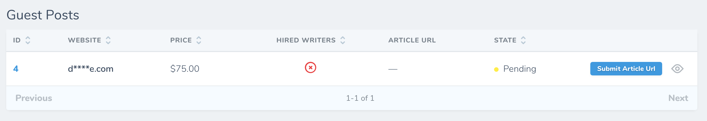

# Guest Posts

[[toc]]

## Giới thiệu

Bạn có thể xem Guest Posts theo từng đơn hàng bằng cách nhấn vào biểu icon hình *con mắt* tại trang chủ [Đơn hàng](/vi/nguoi-mua/don-hang.html#xem-chi-tiet-đon-hang).

Hoặc bạn có thể xem toàn bộ Guest Posts mà bạn đã đặt tại mục **Guest Posts** ở sidebar bên trái tại màn hình Dashboard.

## Xem chi tiết Guest Post

Để xem chi tiết từng Guest Post, bạn hãy bấm vào icon hình *con mắt*. Tại đây, bạn sẽ thấy tất cả những thông tin như Target URLs, Anchor Texts, các quy định về bài đăng của người bán, thông tin về website mà bạn sẽ đăng bài, trạng thái của Guest Post, ...

## Các trạng thái của Guest Post

- **Pending**: Guest Post đang đợi duyệt hoặc đang đợi bạn nộp bài viết.
- **Processing**: Guest Post đang được tiến hành bởi người bán.
- **Live**: Guest Post của bạn đã được đăng.
- **Live - Rejected**: Guest Post đã được đăng nhưng bạn đã từ chối.
- **Complete**: Guest Post đã hoàn thành.

:::tip Thông tin:
Bạn sẽ nhận được thông báo real-time, email, Slack, hay Discord nếu guest post của bạn được đăng (Live). Lúc này, bạn cũng sẽ thấy được domain của website mà bạn đặt mua Guest Post.
:::

## Nộp bài viết

Nếu bạn chưa nộp bài viết trong quá trình đặt đơn hàng thì bạn có thể nộp bằng cách nhấn vào nút **Submit Article URL**.

:::tip Có thể bạn chưa biết
Nếu trong vòng 3 ngày nếu bạn không nộp bài viết, hệ thống sẽ gửi thông báo nhắc nhở cho bạn. Thông báo chỉ được gửi 1 lần duy nhất.
:::

## Trao đổi với người bán

Nếu bạn có vấn đề gì cần trao đổi với người bán thì có thể để lại tin nhắn ở trang **chi tiết Guest Post**.

:::warning Lưu ý:
Bạn sẽ không thấy được khu vực trao đổi này nếu Guest Post đang ở trạng thái **Pending**.
:::

## Chấp nhận Published Url

Sau khi người bán đăng bài viết của bạn, họ sẽ gửi cho bạn một URL tới bài viết đó. 

Nếu mọi thứ đều chính xác, bạn có thể nhấn nút **Approve** để chấp nhận URL này. Hãy để lại đánh giá của bạn cho người bán, họ xứng đáng nhận được những đánh giá tốt nếu bạn cảm thấy hài lòng. Oh My Link cũng dựa vào những đánh giá này để cải thiện chất lượng các websites và người bán.

Sau khi bạn nhấn **Run Action**, Guest Post sẽ được chuyển sang trạng thái **Complete**.

:::danger Chú ý:
Hệ thống sẽ tự động **Chấp nhận** Published Url, nếu trong vòng **2 ngày** (không tính các ngày cuối tuần) kể từ khi người bán gửi Published Url cho bạn mà bạn không **Từ chối** hoặc **Chấp nhận**. 
:::

## Từ chối Published Url

Nếu bạn không hài lòng về bài đăng, bạn có quyền từ chối bằng cách nhấn vào nút **Reject**.

Điền đầy đủ các thông tin để người bán hiểu rõ lý do mà bạn từ chối để họ có thể khắc phục.

Sau khi bạn nhấn **Run Action**, Guest Post này sẽ chuyển sang trạng thái **Live - Rejected** và người bán sẽ nhận được thông báo.