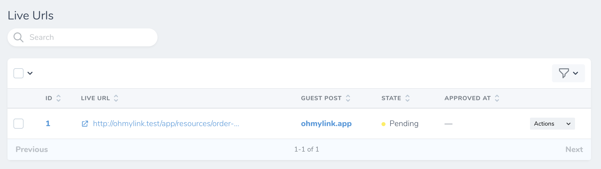
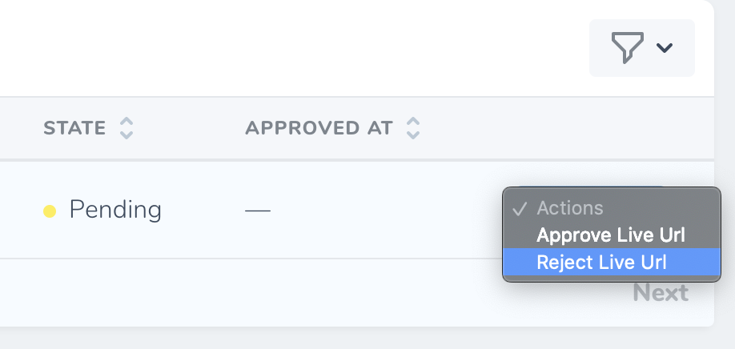
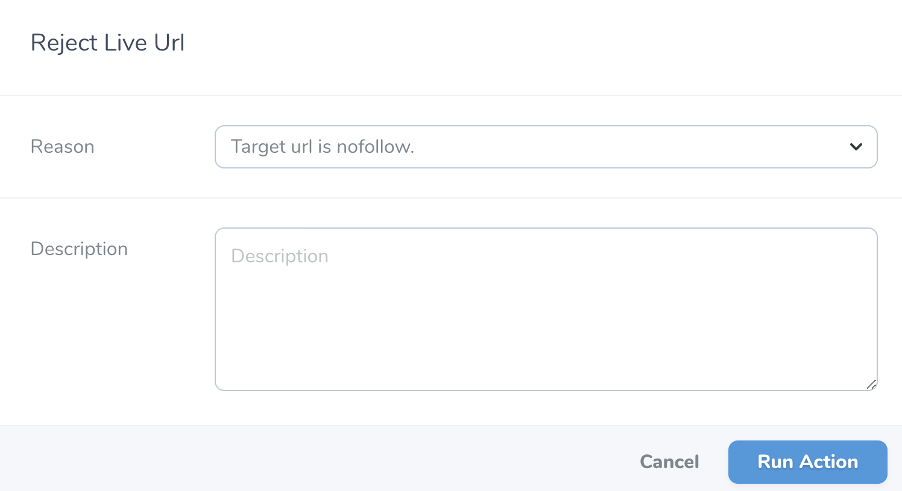
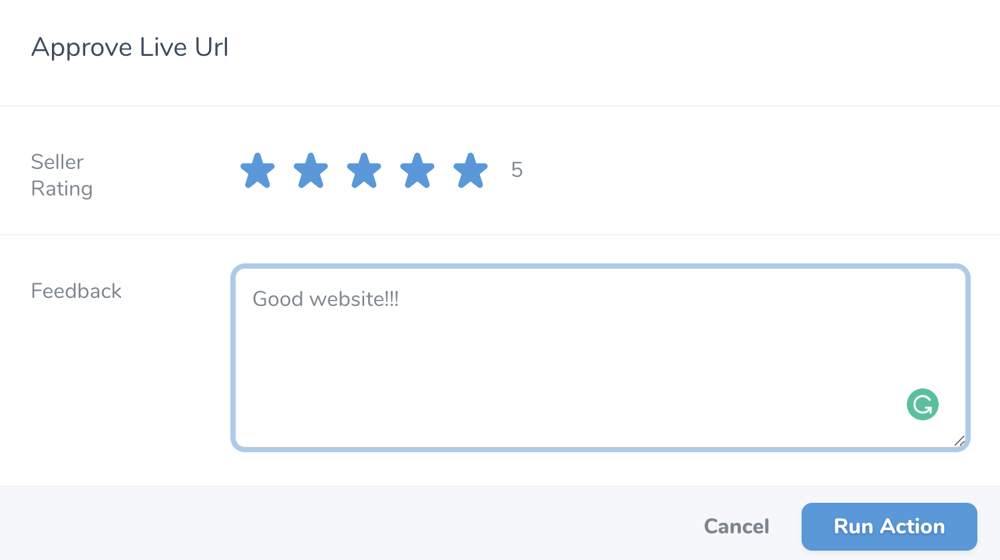
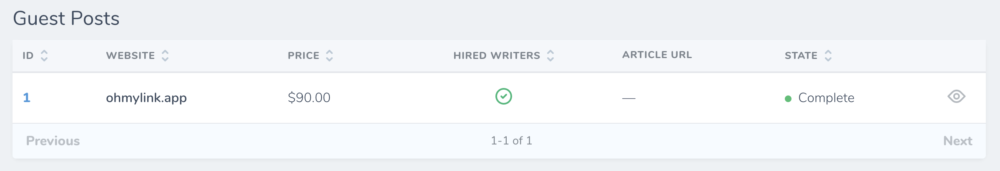

# Live Url

[[toc]]

## Giới thiệu

**Live Url** hiểu nôm na là những backlinks mà bạn có được sau khi người bán đã đăng bài viết Guest Post của bạn lên website của họ.

Bạn có thể xem Live Urls của từng Guest Post trong trang **chi tiết Guest Post** hoặc xem **toàn bộ Live URLs** tại mục **Live Url** ở sidebar bên tay trái của trang Dashboard.

:::tip Lưu ý:

Lúc này, bạn đã thấy được domain của website mà bạn đặt mua Guest Post.
:::

### Khác nhau giữa Guest Post và Live Url
Guest Post là nơi chứa những thông tin mà bạn sẽ gửi cho người bán hoặc thông tin về website mà bạn sẽ đăng guest post lên. 

Còn Live Url là **đường link mà người bán sẽ gửi ngược lại cho bạn** sau khi họ đã đăng bài viết của bạn lên website của họ. Nếu bạn sử dụng [tính năng theo dõi backlinks](/vi/nguoi-mua/live-url.html#theo-doi-live-url) thì bạn sẽ thao tác trên **Live Url**, chứ không phải là **Guest Post**.

## Trạng thái của Live Url

- **Pending:** Live Url đang đợi quyết định của bạn. Bạn có thể chấp nhận hoặc từ chối nếu live url chưa đúng với những yêu cầu của bạn.
- **Rejected:** Bạn đã từ chối Live url.
- **Approved:** Bạn đã chấp nhận Live url.

## Từ chối Live Url

Nếu bạn không hài lòng về bài đăng (hay Live Url), bạn có quyền từ chối bằng cách nhấn vào nút **Reject Live Url**.

Điền đầy đủ các thông tin để người bán hiểu rõ lý do mà bạn từ chối để họ có thể khắc phục.

Sau khi bạn nhấn **Run Action**, Live Url này sẽ chuyển sang trạng thái **Rejected** và người bán sẽ nhận được thông báo.

## Chấp nhận Live Url

Nếu mọi thứ đều chính xác, hãy nhấn nút **Approve Live Url** để xác nhận. Hãy để lại đánh giá của bạn cho người bán, họ xứng đáng nhận được những đánh giá tốt nếu bạn cảm thấy hài lòng. Oh My Link cũng dựa vào những đánh giá này để cải thiện chất lượng các websites.

Sau khi bạn nhấn **Run Action**, Live Url này sẽ chuyển sang trạng thái **Approved**, và Guest Post này cũng sẽ chuyển sang trạng thái Complete.

:::danger Chú ý:
Hệ thống sẽ tự động **Chấp nhận** Live Url, nếu trong vòng **2 ngày** (không tính các ngày cuối tuần) kể từ khi người bán gửi Live Url cho bạn mà bạn không **Từ chối** hoặc **Chấp nhận** Live Url. 
:::

## Theo dõi Live Url

Oh My Link hỗ trợ bạn theo dõi các Live Urls xem có bị tháo bỏ hay bị chuyển từ *dofollow* sang *nofollow* hay không. Hệ thống sẽ gửi thông báo real-time, email, Slack, hay Discord cho bạn nếu 2 trường hợp trên xảy ra.

Để thực hiện việc theo dõi Live Url, yêu cầu Live Url đó phải được chấp nhận. Bạn chỉ việc nhấn vào nút **Add Tracker** và Live Url đó sẽ được theo dõi 24/7.
