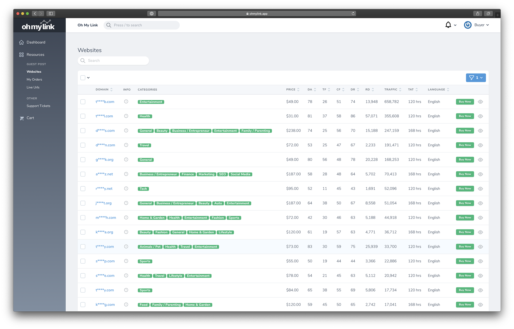
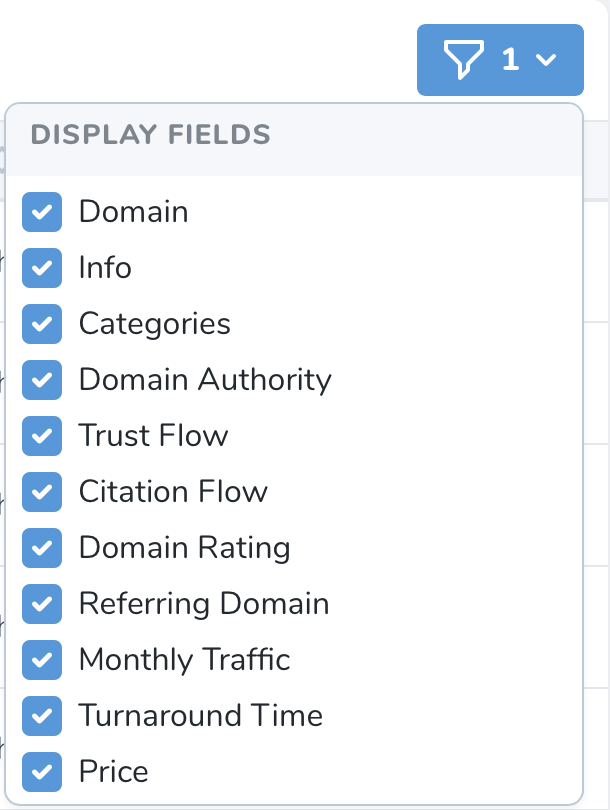
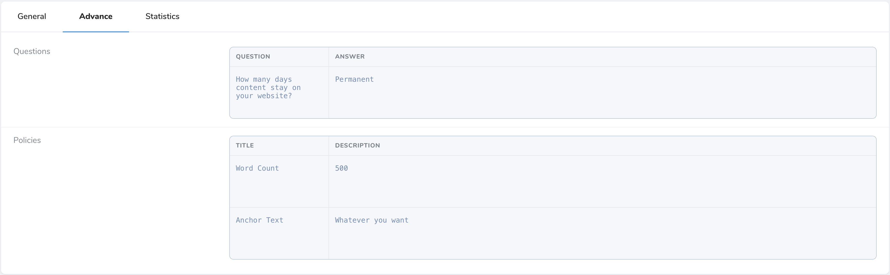
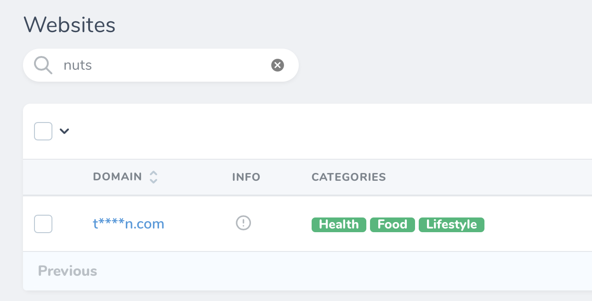
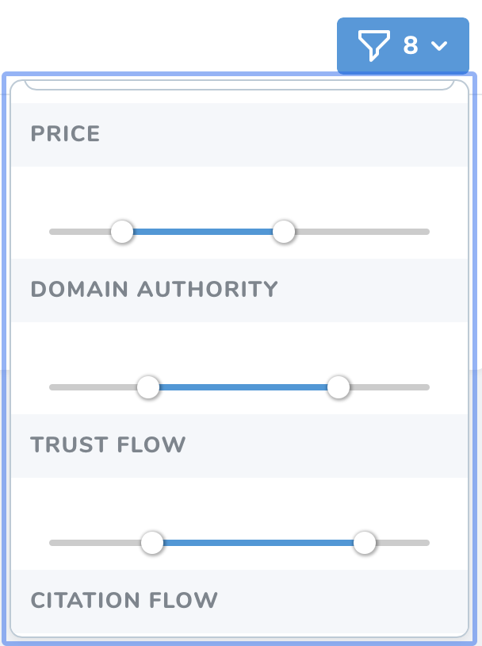
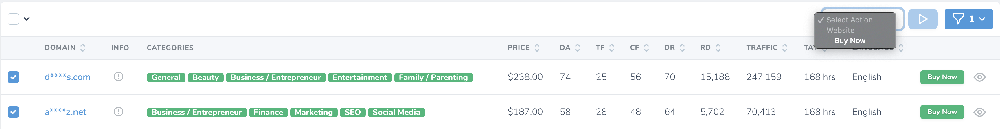
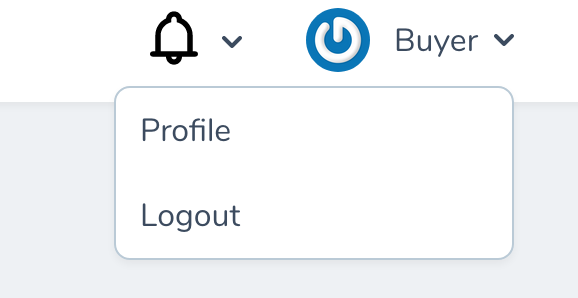
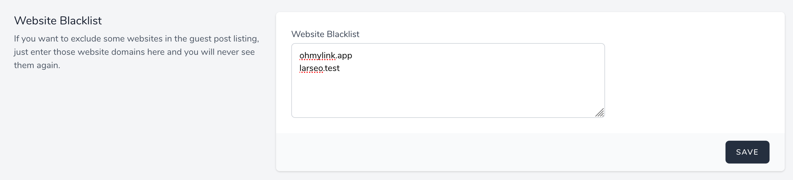

# Websites

[[toc]]

## Giới thiệu

Bạn sẽ xem được toàn bộ websites cho phép đăng Guest Post và đã qua kiểm duyệt bởi Oh My Link tại đây.

Để đảm bảo tính bảo mật của người bán, các tên miền sẽ được che và chỉ hiển thị ký tự đầu, ký tự cuối, và đuôi của tên miền. Bạn sẽ thấy đầy đủ tên miền sau khi người bán cung cấp đường dẫn tới bài đăng của bạn.

Ngoài ra, bạn sẽ thấy mô tả, các chỉ số, danh mục, ngôn ngữ, giá và thời gian đăng bài của các websites.

:::tip Mách nhỏ:
Các chỉ số từ Moz, Majestic, Ahrefs sẽ được cập nhật mỗi tháng để đảm bảo tính chính xác.
:::

## Ẩn / Hiện thông tin website

Bạn có thể ẩn hay hiện các cột thông tin của website bằng cách nhấn vào biểu tượng hình *cái phễu*. Bạn sẽ thấy toàn bộ các cột thông tin mà Oh My Link cung cấp, hãy tùy ý ẩn / hiện các cột theo ý thích của bạn.

 

## Xem chi tiết website

Bạn có thể xem chi tiết từng website bằng cách nhấn vào biểu tượng hình *con mắt*. Ngoài các thông tin ở trang chủ, bạn còn có thể xem thêm các quy định bài đăng của trang web đó.

 

## Tìm kiếm website

Khi website được thêm vào hệ thống của Oh My Link, người bán sẽ được yêu cầu nhập mô tả website của họ. Bạn có thể tận dụng điều này để tìm kiếm những website phù hợp nhất cho mình.

Trên thanh công cụ tìm kiếm, hãy nhập từ khóa mà bạn muốn tìm kiếm. **Ví dụ:** "nuts"

 

## Bộ lọc cho website

Oh My Link cung cấp các bộ lọc để bạn có thể tìm kiếm những websites phù hợp một cách nhanh nhất. 

Các bộ lọc hiện có:

- Lọc theo **Danh Mục** (Ví dụ: Fitness, Recipes, Outdoor, Garden, Home, ...).
- Lọc theo **Giá**. Ví dụ: Từ $70 - $100.
- Lọc theo **Domain Authority (Moz)**. Ví dụ: Từ 10-25.
- Lọc theo **Trust Flow (Majestic)**. Ví dụ: Từ 10-20.
- Lọc theo **Citation Flow (Majestic)**. Ví dụ: Từ 10-20.
- Lọc theo **Domain Rating (Ahrefs)**. Ví dụ: Từ 20-40.
- Lọc theo **Referring Domain (Ahrefs)**. Ví dụ: Từ 200-700.
- Lọc theo **Monthly Traffic (Ahrefs)**. Ví dụ: Từ 500-5000.

 

:::tip Mẹo nhỏ: 
Nhấn Reset Filter để tắt tất cả bộ lọc.
:::

## Đặt Mua Guest Post

Bạn có thể đặt mua Guest Post bằng cách nhấn vào nút **Buy Now**

Hoặc nếu bạn muốn mua nhiều Guest Posts cùng lúc thì hãy chọn vào các *Checkboxes* ở trước tên miền website sau đó nhấn **Buy Now** ở hộp thoại **Select Action**.

## Chặn các websites không mong muốn

Nếu bạn không muốn thấy một số websites nhất định trong danh sách websites, bạn có thể lọc chúng ra bằng cách sử dụng tính năng **Website Blacklist** mà Oh My Link cung cấp.

Để sử dụng tính năng này, bạn truy cập vào trang **Profile**

 
Sau đó kéo xuống dưới bạn sẽ thấy trường **Website Blacklist**, hãy nhập tên miền của những websites bạn muốn chặn, mỗi tên miền nằm trên một dòng và bạn sẽ vĩnh viễn không thấy chúng xuất hiện nữa.
 
 
